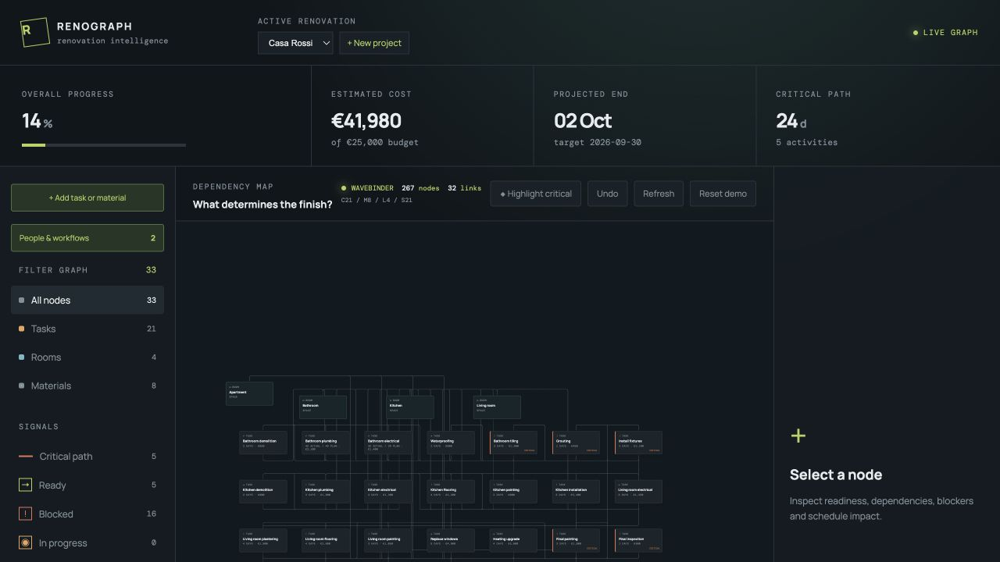
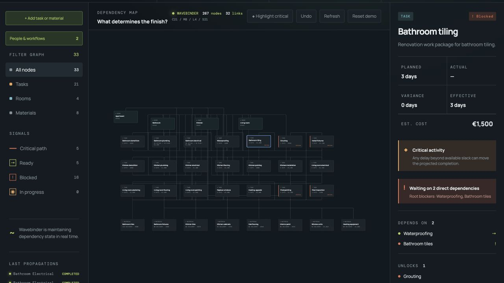
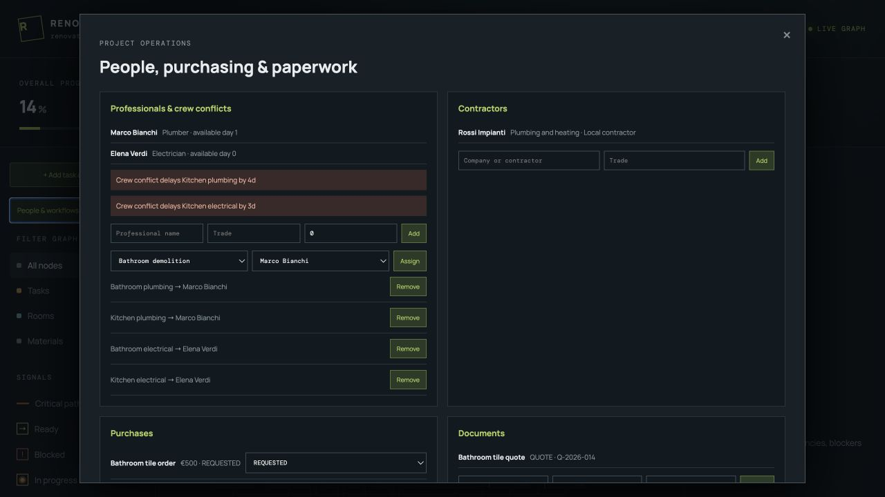

# Renograph

Renograph turns a renovation into a living dependency graph. It shows what is
ready, what is blocked and why, which activities determine the finish date, and
what happens when a task changes.

The contest MVP is a complete runnable application around the canonical Casa
Rossi renovation. It uses Wavebinder as the live reactive dependency runtime,
while renovation-specific scheduling, critical-path analysis, costing and
scenario comparison remain explicit Renograph domain logic.

## Demo

- [Watch the 95-second narrated contest demo](Demo/renograph-contest-demo.mp4)
- [Follow the complete demo script and judge runbook](Demo/demo-script.md)

The video is captured from the runnable Casa Rossi application. It demonstrates
the live Wavebinder graph, critical-path highlighting, blocker explanations,
material choices, an isolated delivery-delay scenario, structured room material
lists and the operational workflow.

## Visual Tour



The main workspace combines the renovation graph with projected completion,
cost, critical-path signals, blockers and live Wavebinder runtime telemetry.

| Reactive dependency inspection | Resource and operational workflows |
| --- | --- |
|  |  |
| Select any task to inspect its direct/root blockers and live `COMPLEX` forecast inputs. | Shared professionals constrain the schedule while purchasing and paperwork remain editable in the local project workflow. |

Every value shown here comes from the runnable local application rather than a
design mock-up. The repeatable interaction sequence is documented below and in
the [`Demo/` package](Demo/).

## Quick Start

Requirements: Node.js 20+ and a valid Wavebinder license.

```bash
git clone https://github.com/mattia-m/RenoGraph.git
cd RenoGraph
npm install
export WAVEBINDER_LICENSE='<license JSON on one line>'
npm run dev
```

Open `http://localhost:5173`.

The API runs on `http://localhost:3001`. The frontend proxies `/api` to it.
The supplied license must not be committed; use an environment variable or a
local ignored `.env` file.

Production build:

```bash
npm run build
WAVEBINDER_LICENSE='<license JSON>' npm start
```

Docker Compose:

```bash
export WAVEBINDER_LICENSE='<license JSON>'
docker compose up --build
```

## Demo Flow

1. Read the project forecast and inspect the live Wavebinder runtime counters.
2. Highlight the critical path and select `Bathroom tiling`.
3. Inspect its direct dependencies, root blockers and structured live task state.
4. Select `Bathroom tiles` to compare its `MULTI` delivery and cost choices.
5. Simulate a 14-day delivery delay and €350 cost increase in an isolated runtime.
6. Compare baseline and scenario completion, cost and affected tasks.
7. Select the bathroom to inspect its `LIST` → `COMPLEX` material bundle.
8. Open the operations workspace to inspect resource conflicts, purchases and documents.

The [narrated video](Demo/renograph-contest-demo.mp4) follows this sequence. The
[demo script](Demo/demo-script.md) also contains the longer interactive flow for
a live jury walkthrough.

## Architecture

```text
React + React Flow
        |
        | HTTP
        v
Express API
        |
        +-- RenovationStore / JSON persistence
        +-- Wavebinder runtime graph
        +-- Ready and blocker derivation
        +-- Scheduling and CPM
        +-- Scenario simulation
```

The application is one deployable process. The browser receives graph-friendly
JSON and never sees internal Wavebinder objects.

```text
Canonical Renograph Model
tasks / materials / relationships
              |
              v
       Wavebinder Mapper
          /          \
         v            v
 Baseline Runtime  Scenario Runtime
 COMPLEX/MULTI/LIST  isolated changes
 derived state       reactive events
 subscriptions       nukeNodes teardown
          \          /
           v        v
      Renograph Analysis
       CPM / cost / impact
              |
              v
          React UI
```

## Why Wavebinder?

| Renograph concern | Wavebinder responsibility |
| --- | --- |
| Task and material facts | Declarative Wavebinder nodes |
| Task dependencies | `dep` relationships with `onUpdate: true` |
| Derived readiness | `CUSTOM_FUNCTION` nodes depending on all prerequisites |
| Material availability | Material fact nodes feeding task readiness |
| Material variants | `MULTI` choices with reactive availability |
| Room material bundles | `LIST` nodes populated with `COMPLEX` material requirements, selected options, delivery times, cost and dependent task IDs |
| Structured task state | `COMPLEX` nodes with status, duration and cost fields |
| Reactive task forecast | `COMPLEX` + `CUSTOM_FUNCTION` projection of plan, actual duration, delay, variance, manual blocker and effective duration |
| Runtime propagation | RxJS node subscriptions and `.next()` updates |
| Independent runtime | A separate `WaveBinder` instance per graph runtime |
| Runtime teardown | `nukeNodes()` during lifecycle cleanup |

| Renograph concern | Renograph responsibility |
| --- | --- |
| Renovation semantics | `NodeType`, statuses and relationship rules |
| Cycle validation | Domain graph validation before topology changes |
| Schedule | Topological earliest/latest pass with selected material delivery constraints |
| Critical path | CPM slack calculation |
| Cost | Domain aggregation and scenario deltas |
| Scenario comparison | Clone, change, recalculate and compare |
| Persistence | Canonical JSON snapshot; derived values are rebuilt |
| Resource-aware scheduling | Professional availability and shared-crew assignments level overlapping work and expose the resulting delay |
| Operations workflows | Contractors, purchases, document references and undoable local changes |
| Project portfolio | Create, persist and switch between isolated renovation graphs |

Wavebinder is not falsely credited with CPM or renovation semantics. It owns
the reactive graph state; Renograph owns renovation intelligence.

### Reactive task forecast

Every task exposes a structured Wavebinder `COMPLEX` forecast generated by a
`CUSTOM_FUNCTION`. Its reactive dependency inputs combine:

- planned duration;
- actual duration captured when work is completed;
- a directly applied manual delay;
- effective duration used by the schedule;
- duration variance against the original plan;
- manual blocker state;
- derived readiness;
- progress and completion state; and
- estimated cost.

Changing one of these facts propagates through Wavebinder immediately. Renograph
then recalculates downstream blockers, schedule dates, costs and the critical
path. The original planned duration remains visible, while the measured actual
duration becomes the effective duration for completed work. A task estimated at
10 days and completed in 3 or 20 days therefore reforecasts dependent work using
3 or 20 days without erasing the initial estimate.

## Domain Model

Initial node types are `ROOM`, `TASK` and `MATERIAL`. Relationships are
`DEPENDS_ON`, `LOCATED_IN` and `REQUIRES_MATERIAL`. Persisted status is kept for
facts such as completion and work in progress. For ordinary tasks, `READY` and
`BLOCKED` are derived from Wavebinder dependency state during runtime rebuild.

The demo contains 33 nodes and more than 50 meaningful relationships across
bathroom, kitchen, living room and whole-apartment work.

It includes chains, fan-in, fan-out, diamond-shaped dependencies, material
requirements and alternative material choices.

## API

The REST API supports project creation and discovery; graph, schedule, blocker,
critical-path and runtime inspection; node and relationship mutation;
professional, contractor, purchase and document workflows; isolated scenarios;
and undo/reset. Renovation operations are scoped below
`/api/renovations/:id`, keeping project graphs isolated.

## Testing

```bash
npm run typecheck
npm test
npm run build
npm run benchmark
```

The tests cover chains, diamonds, parallel slack, blocker roots, cycle
rejection, critical delays, critical-path changes, non-critical delays,
material delivery constraints, structured room bundles, seed graph shape and
baseline immutability. Licensed integration tests cover the real Wavebinder
runtime, populated `LIST`/`COMPLEX` values and material scenarios when
`WAVEBINDER_LICENSE` is configured. The executable Wavebinder spikes are in
`spike/`.

The benchmark reports median and p95 timings for scheduling. With a license it
also measures Wavebinder runtime construction and isolated scenario analysis.
It reports the environment and never invents performance numbers.

## Technical Decisions

- JSON persistence keeps the contest demo zero-setup and restart-safe.
- PostgreSQL is intentionally not required for the MVP; the persistence seam is
  isolated in `RenovationStore` for a later repository implementation.
- Wavebinder is initialized only after a license is supplied and the API fails
  loudly if its runtime is unavailable.
- Scenario state is created through `structuredClone`, never by mutating the
  baseline object.
- Every schedule treats calendar days as working days for determinism.
- Relationship topology changes rebuild the affected runtime because the public
  Wavebinder API does not expose dynamic dependency mutation.

Architecture decisions are recorded in [`docs/adr/`](docs/adr/).

## Known Limitations

- HTTP loading actions are not used yet; material options are deterministic
  custom-function data so the demo remains offline-stable.
- The local multi-project persistence layer is JSON rather than PostgreSQL.
- Project runtimes are currently created eagerly at startup. A lazy or bounded
  runtime cache is intentionally deferred while the portfolio remains a small
  local contest demo.
- A hosted deployment is not included; the repository provides the narrated
  demo video alongside local and Docker workflows.
